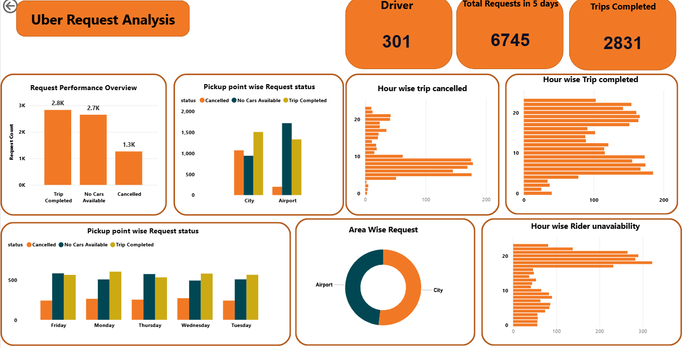
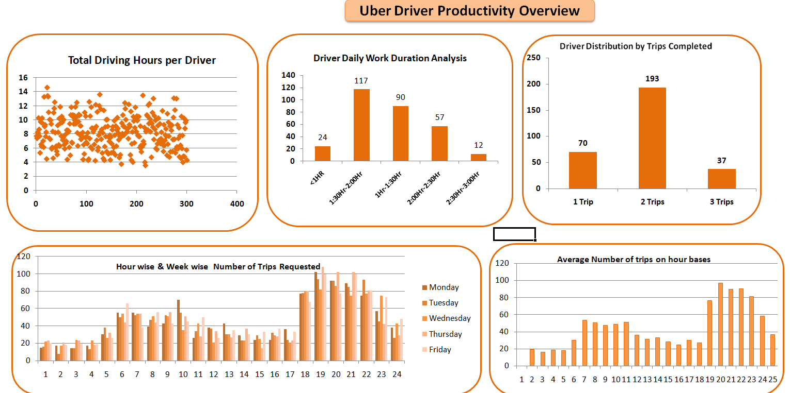

#  🧾 Uber Supply–Demand & Driver Utilization Analysis.

_Analyzed Uber service demand and service availability to find the strategic solution to enhance the customer experience and profit of the Company using SQL , Power bi and Excel._

## 📌 Table of Contents
- <a href="#Overview">Overview</a>
- <a href="#business-problem">Business Problem</a>
- <a href="#dataset">Dataset</a>
- <a href="#tools--technologies">Tools & Technologies</a>
- <a href="#project-structure">project Structure</a>
- <a href="#data-cleaning--preparation">Data Cleaning & Preparation</a>
- <a href="#exploratory-dataanalysis">Exploratory Data Analysis</a>
- <a href="#key-finding">Key Findings</a>
- <a href="#dashboard">Dashboard</a>
- <a href="final-recommendations">Final Recommendations</a>

---
<h2>Overview</h2>
Analyzed Uber supply–demand patterns and driver utilization using SQL and Power BI to identify service gaps, reduce cancellations, and optimize peak-hour driver allocation for improved operational efficiency and revenue growth.

<h2>Business Problem</h2>

- Identify the supply–demand gap in Uber operations.

- Uncover hidden trends in ride request patterns.

- Analyze driver availability and utilization patterns.

- Detect peak-hour demand and service shortages.

- Design optimal, data-driven strategies to improve ride fulfillment rates.

- Recommend solutions to maximize operational efficiency and revenue growth.

---

<h2>Dataset</h2>

The dataset includes trip-level details such as:
- Request ID

- Pickup Point

- Driver ID

- Request Status (Completed, Cancelled, No Cars Available)

- Request Timestamp

- Drop Timestamp

---

<h2>Tools & Technologies</h2>

**SQL**
- Data Cleaning, Added custom columns & Aggregation

 **Power BI**
- Dashboard & Visualization

**Excel**
- Visualization(based on the output of queries)

**Github**

---

<h2>Project Structure</h2>

'''
|----Documentation
|    |--Readme.md
|    |--Project.doc
|
|
|----Query Script
|    |--Sql_queries.doc     #Queries used while Analyzing the data 
|
|
|----Dashboards
|    |--uberpowerbi.pbix
|    |--uber_sql Driver Productivity.xlsx(Excel Dashboard)

'''

<h2>Data Cleaning & Preparation</h2>

- Added Week,hour and trip duration Columns.
- Executed multiple SELECT queries to generate analytical tables for deeper insights.

<h2>Exploratory Data Analysis</h2>

📊 **Exploratory Data Analysis (EDA)**

Performed exploratory data analysis to understand:

- Driver distribution across pickup points

- Weekly and daily driver working hours

- Duration-based driver activity patterns

- Trips completion trends (daily & weekly)

- Driver performance distribution

<h2>Key Findings</h2>

🔍 **Key Business Insights**

- Identified peak demand hours and service gaps
- Detected high cancellation time windows
- Analyzed driver workload distribution
- Measured total driving hours per driver
- Highlighted rider unavailability patterns
- Identified the average number of rides required on an hourly basis to improve service availability.

These insights help ride-sharing companies optimize driver allocation, balance workload distribution, reduce cancellations, and improve overall service efficiency and profitability.

<h2>Dashboard</h2>

- **Power Bi Dashboard Shows:**
  - Supply-Demand Gap Analysis
  - Trip Fulfillment Evaluation
  - Geospatial Request Distribution
  - Temporal Failure Patterns
  - Operational Efficiency Metrics
 
    
  

    

- **Excel Dashboard Shows:**
  - Temporal Demand & Supply Alignment
  - Driver Productivity Profiling
  - Labor Distribution Analysis
  - Operational Peak Identification
 
   

'''

